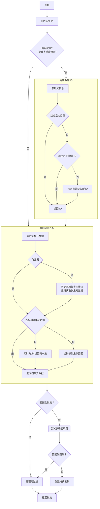

# 剧集获取逻辑

- [剧集获取逻辑](#剧集获取逻辑)
  - [使用`基础剧集解析器`获取剧集](#使用基础剧集解析器获取剧集)
  - [使用`AnitomySharp 剧集解析器`获取剧集](#使用anitomysharp-剧集解析器获取剧集)

## 使用`基础剧集解析器`获取剧集

 #TODO

## 使用`AnitomySharp 剧集解析器`获取剧集

1. 确定系列 ID
   - 使用本地配置的 ID
   - 如果启用`处理多季度目录`
     - 跳过特殊目录
     - 若 Jellyfin 已配置 ID，则跳过
     - 根据剧集的父目录重新获取 ID
2. 基础规则匹配
   - 获取剧集列表，按索引查找对应剧集
   - 若类型为 Special 且列表为空，则改用全部类型重新获取
   - 若索引为 0 且列表非空，返回第一集
   - 若存在替代集数，则尝试用替代集数匹配
3. 多季度规则匹配
   - 如果基础匹配失败且为普通剧集，则尝试处理多季连续编号场景
   - 查找当前系列的续集，累计总集数，定位目标系列和相对索引，再次匹配

