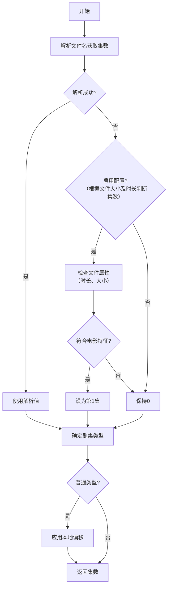

# 集数获取逻辑

- [集数获取逻辑](#集数获取逻辑)
  - [注意事项](#注意事项)
  - [使用`基础剧集解析器`获取集数](#使用基础剧集解析器获取集数)
  - [使用`AnitomySharp 剧集解析器`获取集数](#使用anitomysharp-剧集解析器获取集数)

## 注意事项

- 如果本地配置了偏移值，则在前面的基础上减去该偏移值（支持正负数）

## 使用`基础剧集解析器`获取集数

 #TODO

## 使用`AnitomySharp 剧集解析器`获取集数

相关代码：`AnitomyEpisodeParser.GetEpisodeIndex()`

> [!note] 特殊说明
> 通常电影文件命名中并未包含集数，而 Bangumi 中则默认为第一集。设置为`1`有助于匹配 Bangumi 剧集元数据

